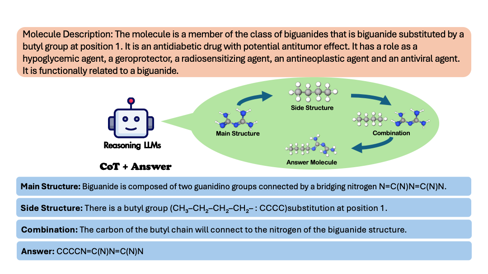
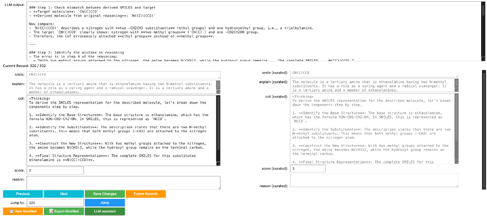

# Molecule Generation through Reasoning with Large Language Models

This repository contains the codebase, dataset, and models for the paper **Molecule Generation through Reasoning with Large Language Models**.

## 📖 Abstract

Molecule generation is significant for its potential in scientific discovery and practical applications. Recent attempts often frame this task as a translation problem from molecular captions to structural representations, such as SMILES. This work examines the feasibility of modeling the task as a reasoning process with large language models (LLMs), generating higher-quality molecules through structural decomposition and recombination within curated Chain-of-Thought (CoT). 

We introduce a workflow for curating accurate CoT data, incorporating both machine and expert verification. With a limited dataset of 4,213 curated samples, namely **MolCoT-4K**, we can elicit strong reasoning capabilities for molecule generation in open-source LLMs such as Qwen2.5-7B. The resulting model, **MolGeneration**, achieves state-of-the-art exact match accuracy over strong open-source baselines (MolT5, LlaSMol, ether0) as well as advanced commercial LLMs (GPT-4o). Moreover, MolGeneration attains a Pass@16 exact match accuracy of 48.46%, highlighting its strong potential for real-world experimental applications.

## 📂 Repository Structure

- `text2mol_data/`: Contains the **MolCoT-4K** dataset, the first curated chain-of-thought (CoT) dataset for molecule generation.
- `Curation_Tool/`: An interactive UI tool built to enable chemical experts to efficiently label, verify, and refine LLM-generated CoT traces.
- `Training/`: Training scripts implementing the two-stage post-training strategy (Supervised Fine-Tuning and Reinforcement Learning via GRPO).
- `agreement check/`: Includes the multi-rater agreement results validating our expert annotations (Cohen's $\kappa$ of 0.767 and Fleiss' $\kappa$ of 0.738).
- `MolReasoner_result/`: Outputs and comparisons with baseline methods.

## 🧪 MolCoT-4K Dataset

**MolCoT-4K** consists of 4,213 expertly curated samples. Each sample explicitly generates intermediate structures and functional groups from a molecular description (e.g., main structure and side structure) before constructing the final SMILES representation. This compositional reasoning paradigm produces interpretable traces aligned with chemical knowledge.

### Curation Tool
To facilitate dataset construction, we built a dedicated curation tool that allows experts to assign scores, make corrections, and record rationales for scoring:

### Curation Score Distribution
*Only 8% of distilled CoT data was initially correct, highlighting the absolute necessity of our human-expert curation step.*
<iframe src="curation_score_distribution.pdf" width="100%" height="600px"></iframe>

## ⚙️ MolGeneration Model

**MolGeneration** leverages a two-stage training strategy on Qwen2.5-7B:
1. **Supervised Fine-Tuning (SFT)**: Warm-up training on MolCoT-4K to equip the model with reasoning behavior.
2. **Reinforcement Learning (RL)**: We use GRPO with a molecule-specific ensemble reward (including correctness, format, and RDKit-verified SMILES validity) to heavily optimize the chemical reasoning.

### Results
Our reasoning model heavily outperforms translation-only models, particularly in fine-grained exact matching:
<iframe src="Qwen2.5_vs_Qwen3_Validity_RDK_EM.pdf" width="100%" height="600px"></iframe>

On the real-world **SMolInstruct** evaluation dataset, MolGeneration achieves an Exact Match (EM) score of **44.97%**, far surpassing GPT-4 (6.40%), Gemini-2.5-Pro (19.49%), and MolT5 (31.70%).
